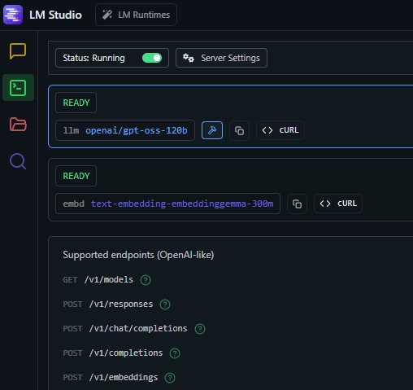
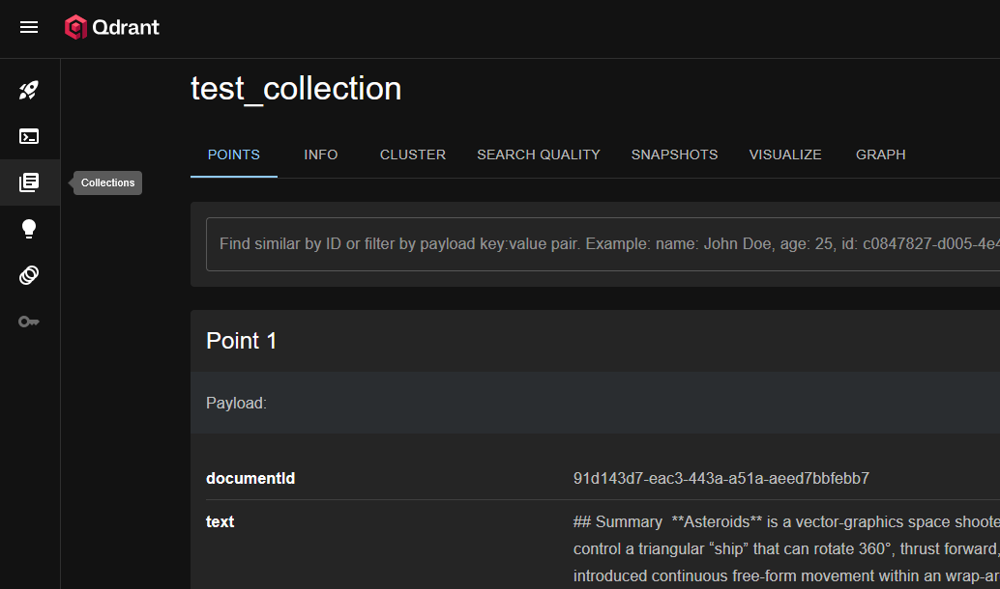
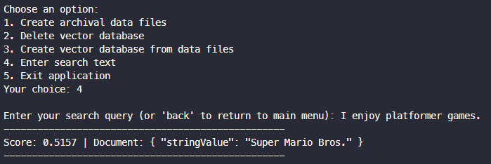

# Dimensions

## :movie_camera: Background

This application:
- generates embeddings using a local language model,
- stores those embeddings within a vector database 
- supports the querying of that data.

It was designed as a simple tool for testing the capabilities of embeddings when used as part of semantic search use cases.

## :white_check_mark: Scope

- [x] Create simple console application.
- [x] Integrate local language model.
- [x] Integrate local vector database.
- [x] Provide search function.
- [x] Apply normalisation to embeddings.
- [x] Implement basic chunking, use markdown format for input.
- [x] Implement contextualisation, use alternative local LLM.
- [ ] Test with alternative embeddings model.
- [ ] Test with alternative chat completion model.

## :telescope: Future Gazing

- [ ] Explore capabilities of the Qdrant vector database, understand how search queries can be adjusted to affect results. 
- [ ] Consider adding a lexical search option for comparing results.

## :beetle: Known defects

No known defects.

## :crystal_ball: Use of AI

[GitHub Copilot](https://github.com/features/copilot) was used to assist in the development of this software.

## :rocket: Getting Started

### :computer: System Requirements

#### Software


> [!NOTE]
> Other operating systems and versions will work, where versions are specified treat as minimums.

#### Hardware

A system capable of running LM Studio is required.

Details of my personal system are below.


> [!NOTE]
> The hardware in use on my PC includes an Accelerated Processor Unit (APU) which combines CPU and GPU on a single chip. Recommendations for alternative hardware can be found [here](https://lmstudio.ai/docs/app/system-requirements), performance will depend upon the models you choose to run (and other operational factors).

### :floppy_disk: System Configuration

#### LM Studio

Configure LM Studio as per the [documentation](https://lmstudio.ai/docs/app/basics).

Download:
- an appropriate text embedding model,
- an appropriate LLM model for chat completion.

> [!NOTE] 
> You can use [community leaderboards](https://huggingface.co/spaces/OpenEvals/find-a-leaderboard) to help select appropriate models.

Use the Developer tab to run your chosen models using the [API server](https://lmstudio.ai/docs/app/api).

You can use [Postman](https://www.postman.com/) to test access to the endpoints.

If testing your text embeddings model using the default options, you can test the local server by configuring a `POST` request with the following parameters:

URL:
```
http://127.0.0.1:1234/v1/embeddings
```

Headers:
```
 Content-Type: application/json
```

Body (raw):
```
{
    "input": "Hello world!"
}
```

You should see a response which includes the embedding values:

```
{
    "object": "list",
    "data": [
        {
            "object": "embedding",
            "embedding": [
                0.03805531933903694,
                0.032784245908260345,                
                ...
                -0.006903552915900946,
                -0.02046305313706398
            ],
            "index": 0
        }
    ],
    "model": "text-embedding-embeddinggemma-300m",
    "usage": {
        "prompt_tokens": 0,
        "total_tokens": 0
    }
}
```
#### Application

The `appsettings.json` file manages the application settings.

Review the file and ensure that the settings are appropriate for your local environment.

E.g. update the models names as required:

```json
{
  "EmbeddingApi": {
    ...
    "Model": "text-embedding-embeddinggemma-300m"
  },
  "ChatCompletionApi": {
    ...
    "Model": "openai/gpt-oss-120b"
  },
  ...
}
```

The data under test can be configured. The software is designed to use your chosen LLM to create archival data to index.

> [!NOTE]
> The quality of your archival data will depend on the model you choose. Consider trying multiple models to generate archival data.

The system is configured to use the `game-historian.md` system prompt when generating archival data. You may choose to write an alternative system prompt for generating archival data. If you do, update the configuration with the new prompt location:

```json
{
    ...
    "SystemPromptPath": ...,
    ...
}
```

The `ContextSectionChunkTitles` setting specifies which sections from your archival data markdown capture a useful summary of the document's content, these sections will be added to all document chunks to maintain context.

The `ArchivalTopics` setting specifies topics for the generation or archival data. These topics will be passed into your chosen LLM along with the system prompt to generate archival data.

You may choose to adjust either of these settings if you author your own system prompt or change the topics to be searched.

Related settings:

```json
{
  "Contextualisation": {
    "ContextSectionChunkTitles": [
      ...
    ]
  },
  "ArchivalTopics": [
    ...
  ]
}
```
### :wrench: Development Setup

Clone the repository.

Open in Visual Studio code.

Build the projects.

## :zap: Features

The software reads `.txt` files and generates embeddings for their content.

The embeddings are stored within a vector database.

You can submit search terms to test their similarity to the generated embeddings.

## :paperclip: Usage

Start the [Qdrant](https://qdrant.tech/) vector database Docker container, the configuration for which is located in the `docker` directory.

Start LM Studio and ensure that both your text embedding and LLM models are running:



> [!NOTE]
> If you are unable to run both models simultaneously due to lack of resources, consider running the LLM only while generating archival data. You can then eject the model and load your text embedding model for indexing and searching.

Hit F5 in VS Code to begin debugging.

The application is configured to load within the integrated terminal, you should be presented with multiple options:


Create your archival data files, if they do not yet exist:

```bash
1. Create archival data files
```

> [!NOTE]
> This operation can take a long time to complete. Consider adjusting the system prompt and related archival data settings to simplify the operation. Note that simplifying or reducing the archival data will affect the semantic meaning and search capabilities.

When your archival data files have been created, create the vector database:

```bash
1. Create vector database from data files
```

You can view the content of your vector database using the following URL: 
http://localhost:6333/dashboard



Once you have data within your vector database, you can perform a search:

```bash
4. Enter search text
```

You will then see results which display a relevancy score:



## :wave: Contributing

This repository was created primarily for my own exploration of the technologies involved.

## :gift: License

I have selected an appropriate license using [this tool](https://choosealicense.com/).

This software is licensed under the [MIT](LICENSE) license.

## :book: Further reading

More detailed information can be found in the documentation:
* [Resources](docs/resources.md)