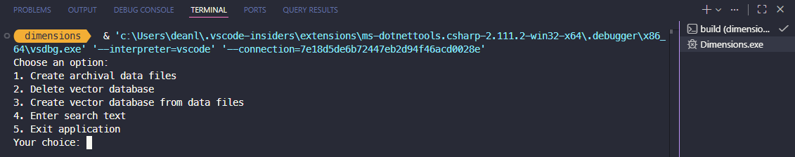

# Dimensions

## :movie_camera: Background

This application:
- generates of embeddings using a local language model,
- stores those embeddings within a vector database 
- supports the querying of that data.

It was designed as a simple tool for testing the capabilities of embeddings when used as part of semantic search use cases.

> [!NOTE]
> See scope for current planned activities, further work is required before the tool produces useful results.

## :white_check_mark: Scope

- [x] Create simple console application.
- [x] Integrate local language model.
- [x] Integrate local vector database.
- [x] Provide search function.
- [ ] Apply normalisation to embeddings (in progress).
- [ ] Implement basic chunking, use markdown format for input (in progress).
- [ ] Implement contextualisation, use alternative local LLM.

## :telescope: Future Gazing

- [ ] Explore capabilities of the Qdrant vector database, understand how search queries can be adjusted to affect results. 
- [ ] Consider adding a lexical search option for comparing results.

## :beetle: Known defects

No known defects.

## :crystal_ball: Use of AI

[GitHub Copilot](https://github.com/features/copilot) was used to assist in the development of this software.

## :rocket: Getting Started

### :computer: System Requirements

#### Software


> [!NOTE]
> Other operating systems and versions will work, where versions are specified treat as minimums.

#### Hardware

A system capable of running LM Studio is required.

Details of my personal system are below.


> [!NOTE]
> The hardware in use on my PC includes an Accelerated Processor Unit (APU) which combines CPU and GPU on a single chip. Recommendations for alternative hardware can be found [here](https://lmstudio.ai/docs/app/system-requirements), performance will depend upon the models you choose to run (and other operational factors).

### :floppy_disk: System Configuration

#### LM Studio

Configure LM Studio as per the [documentation](https://lmstudio.ai/docs/app/basics).

Download an appropriate embeddings model.

> [!WARNING]
> LM Studio allows the loading of language models into the running server, however, I have noticed when testing locally that these fail when generating embeddings.

You can use [community leaderboards](https://huggingface.co/spaces/OpenEvals/find-a-leaderboard) to help select an appropriate model.

Use the Developer tab to run your chosen model as an [API server](https://lmstudio.ai/docs/app/api).

You can use [Postman](https://www.postman.com/) to test access to the endpoints.

If using the default options, you can test the local server by configuring a `POST` request with the following parameters:

URL:
```
http://127.0.0.1:1234/v1/embeddings
```

Headers:
```
 Content-Type: application/json
```

Body (raw):
```
{
    "input": "Hello world!"
}
```

You should see a response which includes the embedding values:

```
{
    "object": "list",
    "data": [
        {
            "object": "embedding",
            "embedding": [
                0.03805531933903694,
                0.032784245908260345,                
                ...
                -0.006903552915900946,
                -0.02046305313706398
            ],
            "index": 0
        }
    ],
    "model": "text-embedding-embeddinggemma-300m",
    "usage": {
        "prompt_tokens": 0,
        "total_tokens": 0
    }
}
```

### :wrench: Development Setup

Clone the repository.

Open in Visual Studio code.

Build the projects.

## :zap: Features

The software reads `.txt` files and generates embeddings for their content.

The embeddings are stored within a vector database.

You can submit search terms to test their similarity to the generated embeddings.

## :paperclip: Usage

Populate your `data` directory with multiple `.txt` files, each representing a single entity.

Start the [Qdrant](https://qdrant.tech/) vector database Docker container, the configuration for which is located in the `docker` directory.

Start LM Studio and ensure your chosen model is running.

Hit F5 in VS Code to begin debugging.

The application is configured to load within the integrated terminal, you should be presented with multiple options:



Select the appropriate option from the menu to load your data and populate your vector database.

Select the search option to test queries against your populated vector database.

You can view the content of your vector database using the following URL: 
http://localhost:6333/dashboard

## :wave: Contributing

This repository was created primarily for my own exploration of the technologies involved.

## :gift: License

I have selected an appropriate license using [this tool](https://choosealicense.com//).

This software is licensed under the [MIT](LICENSE) license.

## :book: Further reading

More detailed information can be found in the documentation:
* [Resources](docs/resources.md)